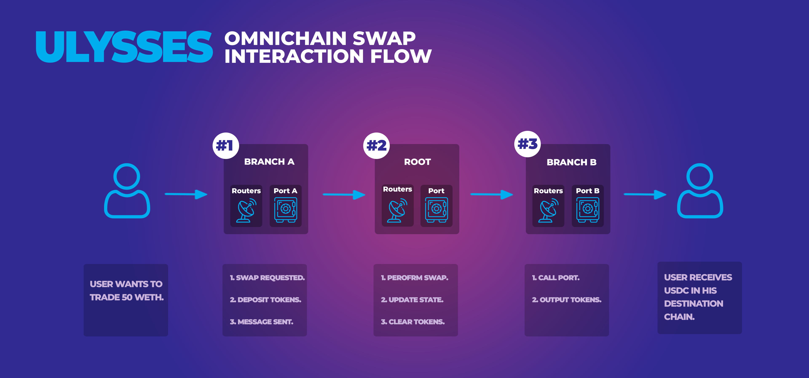

[//]: # (TODO: Add some links / referneces to Ports and Virtualized Liquidity docs pages)

When using with our platform, a user will interact with a Router. This router acts in the same way that a neural pathway works in a body - relaying information back and forth between its different organs. These routers not only manage user requests but also take on the responsibility for the system's responses. By acting as an intermediary between the user and the system, it ensures that the connection is made without any issues.

## Overview

There are two types of Routers:

### 1. Branch Routers
These are the user facing entry and exit points for the omnichain system. In response to a given user's request, Branch Routers are responsible for user balances pending to be deposited, communicating with the local Branch Port (_learn more about Ports_ [_here_](./01-ports.md)) for the depositing / withdrawing user assets as well as with the virtualized token contracts.

### 2. Root Routers
Are present in the Root Chain and communicate with all the connected Branch Chains, sending and receiving requests. Similarly to the Branch Router, these too communicate with a Port and the different virtualized assets (_read more about Virtualized Liquidity_ [_here_](./03-virtual-liquidity.md)), but are responsible for keepig track of pending user [Settlements](../glossary#settlements) instead of [Deposits](../glossary#deposits). In response to user requests Root Routers interact with different apps like UniswapV3, Maia Vaults, Hermes Gauges and their respective Voting systems.

## Interaction Flow of a Swap

Lets take a look at a pratical example of a swap and see how the user interacts (inderectly) with the Branch and Root Routers. 

### 1. User Request
User starts off by sending a request to the Branch Router providing the necessary to execute a swap.

### 2. Deposit Assets 
Source Branch Router, from the chain which the user is connected to, receives the request for the swap, transfering and locking the necessary balance from user. A request is then sent to it's corresponding Root Router, via Anycall messaging layer, with the essential data.

### 3. Receive Request
Root Router receives the Branch Router data and validates the authenticity of the request and deposit data.

### 4. Perform Swap
Root Router performs call for the requested user swap.

### 5. Create Settlement and Send Response
Root Router creates settlement for the user token output and sends token clearence request to the exit chain's Branch Router.

### 6. Receive Request and Clear Tokens
Destination Branch Router receives Root Router communication and requests token clearance for user withdrawal from the local Port.

